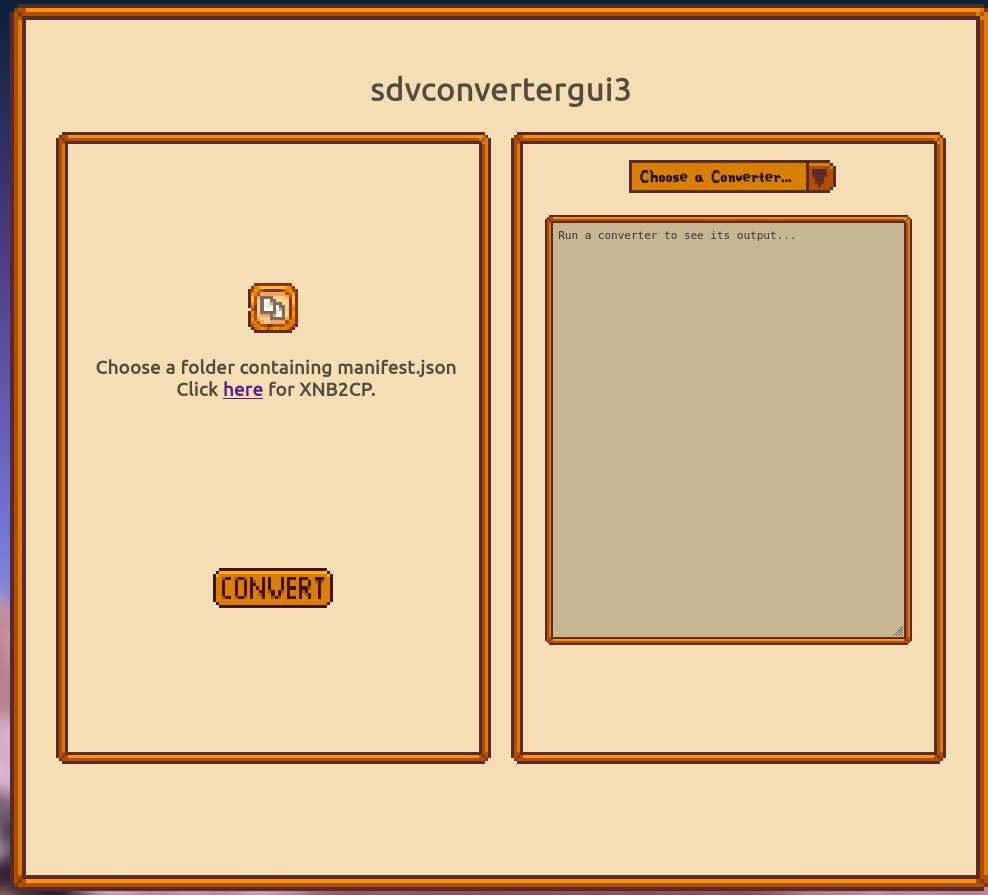
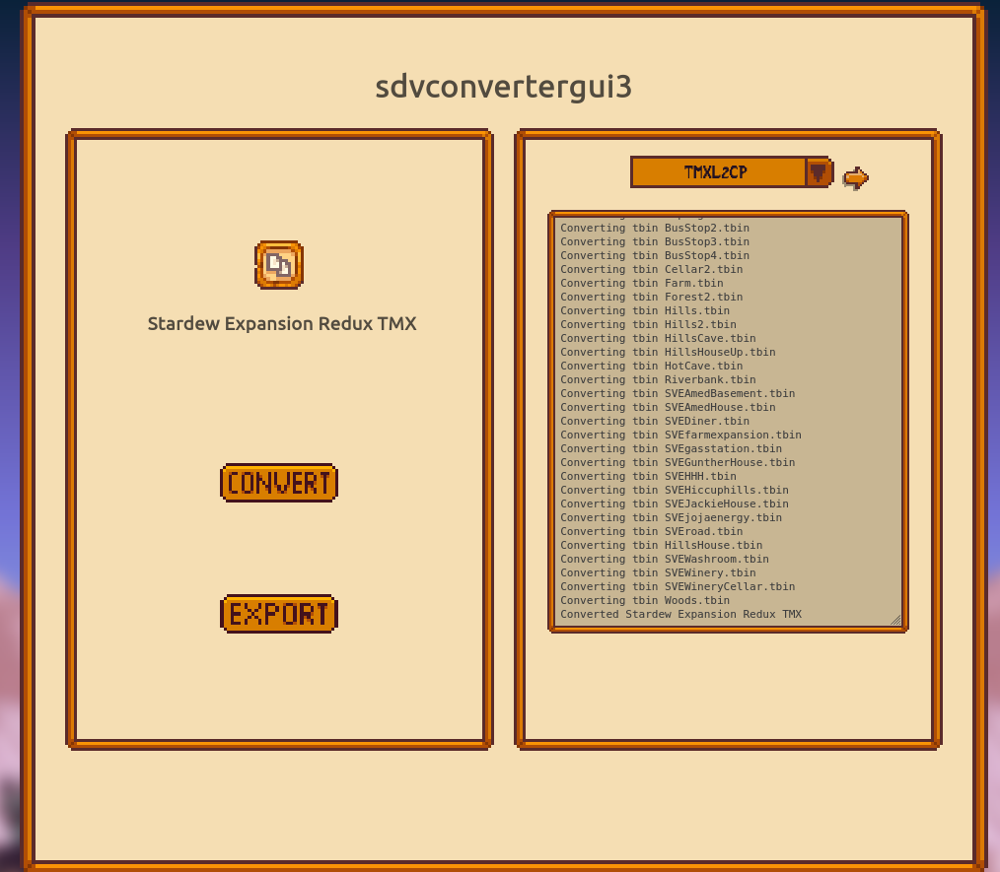
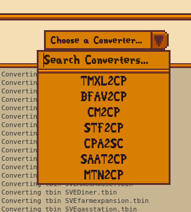

    <image src="src/static/favicon.png">
    <h1>sdvconvertergui3</h1>

The sequel to [sdvconvertergui2](https://github.com/anotherpillow/sdvconvertergui2)

it's web-only, so you can use it here: [https://converters.pillow.rocks](https://converters.pillow.rocks)

## Usage

1. Visit the [page](https://converters.pillow.rocks)
2. Select thefolder containing the `manifest.json` for the original mod you want to use.
3. Choose the suitable converter for that mod
4. Press the convert button and wait for it to complete.
5. Press the export button to download the converted, zipped mod.

## Supported converters

- [BFAV2CP](https://github.com/AnotherPillow/BFAV2CP) by AnotherPillow
- [TMXL2CP](https://github.com/AnotherPillow/TMXL2CP) by AnotherPillow
- [CM2CP](https://github.com/AnotherPillow/CM2CP) by AnotherPillow
- [STF2CP](https://github.com/AnotherPillow/STF2CP) by AnotherPillow
- [CPA2SC](https://github.com/AnotherPillow/CPA2SC) by AnotherPillow
- [SAAT2CP](https://github.com/AnotherPillow/SAAT2CP) by AnotherPillow
- [MTN2CP](https://github.com/AnotherPillow/MTN2CP) by AnotherPillow

## Attribution

All converters are used with permission, and the original authors can be found above.
The main background image is used with permission from [Custom Menu Background](https://www.nexusmods.com/stardewvalley/mods/7416).
Tbin parsing is using [a fork](https://github.com/AnotherPillow/Tbin/tree/emscripten) of kittycatcasey's [Tbin](https://github.com/spacechase0/Tbin) library, licensed under the MIT license.

## Images

